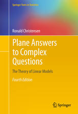
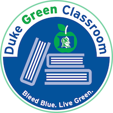

### Description

This course introduces students to Gaussian linear models and
extensions for model building, including exploratory data analysis
techniques, variable transformations and selection, parameter
estimation and interpretation, prediction, hierarchical models, model
selection and Bayesian model averaging. The concepts of linear models
will be covered from Bayesian and classical viewpoints. Topics in
Markov chain Monte Carlo simulation will be introduced as required,
however it is expected that students have either taken STA 601 or are
co-registed.

All students should be extremely comfortable with linear/matrix algebra and
mathematical statistics at the level of STA 611 (Statistical Inference
- Casella and Berger is an excellent resource).  If you need to
review linear algebra, please explore resources under [Links](/links)

* * *

### Instructional Team:

|------------+---------+------------+-----------+----------|
| Role | Name | email | office hour location | office hours
|:-----------|:--------------------|:-------------------|
|Professor   | [Dr. Merlise Clyde ](http://stat.duke.edu/~clyde) | [clyde@duke.edu](mailto:clyde@duke.edu) | 214A Old Chemistry | MW  10-11  or by appointment
|:-----------|:--------|:------------|:-----------|:--------|
|TA         | [Dave Klemish](http://stat.duke.edu/people/david-klemish-0)|[david.klemish@duke.edu](mailto:david.klemish@duke.edu) | 211 Old Chemistry | T
|:-----------|:--------|:------------|:-----------|:--------|
TA | [Sayan Patra](http://stat.duke.edu/people/sayan-patra) | [sayan.patra@duke.edu](mailto:sayan.patra@duke.edu)      | 211 Old Chemistry | W 8-9pm 116 Old Chem
|:------------+----------+-----------+------------+---------|

* * *

### Books & Materials:

{:.right}

* Textbook: [Plane Answers to Complex
Questions](http://getitatduke.library.duke.edu/?sid=sersol&SS_jc=TC0000508493&title=Plane%20Answers%20to%20Complex%20Questions%3A%20The%20Theory%20of%20Linear%20Models)
Ronald Christensen (2011) 4th Edition Springer-Verlag, NY. 
The textbook is freely as an [eBook](http://getitatduke.library.duke.edu/?sid=sersol&SS_jc=TC0000508493&title=Plane%20Answers%20to%20Complex%20Questions%3A%20The%20Theory%20of%20Linear%20Models)
thru the Duke Library. You're welcomed to read on screen or print it
out. If you prefer a paperback version you can buy it at the cost of
printing from Springer or purchase a hardback version at the Bookstore.

* [Data Analysis Using Regression and Multilevel/Hierarchical
  Models](http://www.amazon.com/gp/product/052168689X/ref=as_li_qf_sp_asin_il_tl?ie=UTF8&camp=1789&creative=9325&creativeASIN=052168689X&linkCode=as2&tag=andrsblog0f-20&linkId=PX5B5V6ZPCT2UIYV)
  Gelman & Hill (2009)  ISBN-13: 978-0521686891  

* (optional reference) A First Course in Bayesian Statistical Methods,
Hoff, P. L.  (2009), Springer.  ISBN 978-0-387-92299-7 [get it @
Duke](http://getitatduke.library.duke.edu/?sid=sersol&SS_jc=TC0000296463&title=A%20First%20Course%20in%20Bayesian%20Statistical%20Methods)
Used in co-requisite course STA 601.

* Computer: You should have access to a laptop or desktop capable of
  running [R or RStudio](/resources).  We will use R as a programming language
  at later stages for data analysis and use existing packages written
  in R to support the course.  See the [Resources]({{site.baseurl}}/resources) page
  for books and other reseources for learning R.

* Calculator: You should bring a calculator to exams. There is no
  restrictions on the type of calculator (but not on a mobile device)

* * *

### Class meetings:

* Lectures: Tuesday and Thursday, 3:05 pm - 4:20 pm,
  Biological Sciencs 154 

* * *

### Grade breakdown:

<table style="width:400px;">
<tr> <td> Homework              </td> <td> 20% </td></tr>
<tr> <td> Midterm         </td> <td> 25% </td></tr>
<tr> <td> TakeHome        </td> <td> 25% </td></tr>
<tr> <td> Final            </td> <td> 25% </td></tr>
<tr> <td> Participation        </td> <td> 5% </td></tr>

</table>

* * *

### Exams:

* Inclass Midterm:  Tuesday, TBA
* TakeHome: Tuesday, TBA
* Final: Sunday, December 18 7:00 PM - 10:00 PM

* * *

### Assignments:

Assignments and Due dates are in the [Course Calendar]({{site.baseurl}}/calendar)

* * *

### Discussion Forums

We will be using
[Piazza](https://piazza.com/duke/fall2016/sta72101f16/home) for class
discussion. The system is highly catered to getting you help fast and
efficiently from classmates, the TAs, and myself. Rather than emailing
questions to the teaching staff, I encourage you to post your
questions on Piazza (peer answers earn participation points!). If you
have any problems or feedback for the developers, email
team@piazza.com.

Find our class page at:
[Piazza](https://piazza.com/duke/fall2016/sta72101f16/home)  or
through the link on Sakai.    [Click to signup](piazza.com/duke/fall2016/sta72101f16)

***

### Holidays:

* Friday October 7 7 pm - Wednesday October 12 8:30 am Fall Break
* Tuesday November 22 10:30 pm  - Monday November 28 8:30 am  Thanksgiving Break

* * *

### Green Classroom

{:.right}

This course has achieved Duke’s Green Classroom Certification. The certification indicates that the faculty member teaching this course has taken significant steps to green the delivery of this course. Your faculty member has completed a checklist indicating their common practices in areas of this course that have an environmental impact, such as paper and energy consumption. Some common practices implemented by faculty to reduce the environmental impact of their course include allowing electronic submission of assignments, providing online readings and turning off lights and electronics in the classroom when they are not in use. The eco-friendly aspects of course delivery may vary by faculty, by course and throughout the semester. Learn more at [http://sustainability.duke.edu/action/certifications/classroom/index.php](http://sustainability.duke.edu/action/certifications/classroom/index.php).

